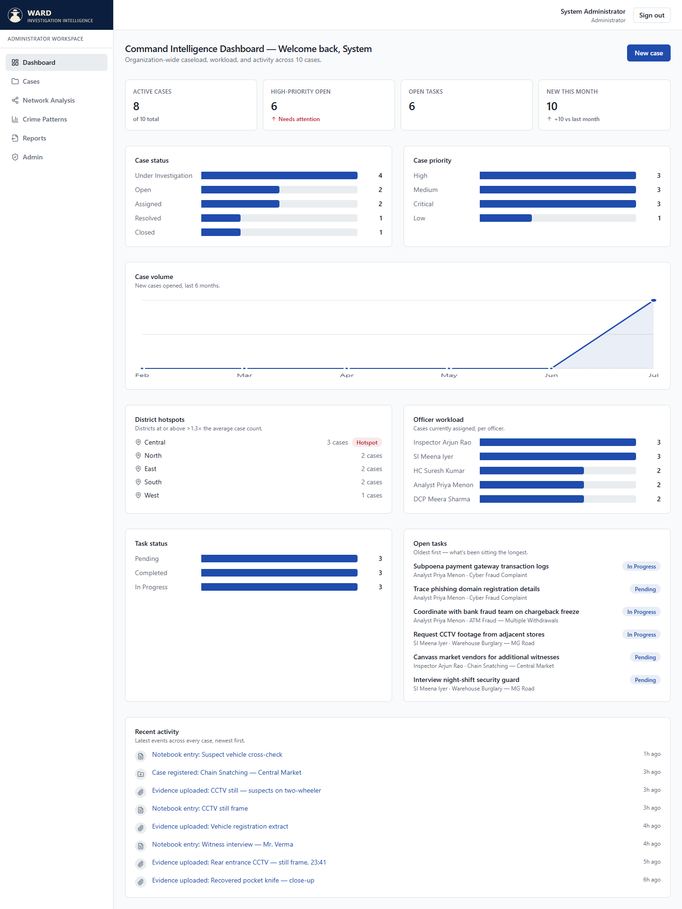
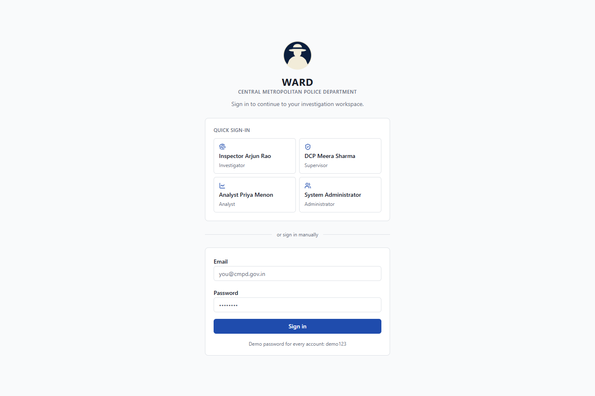
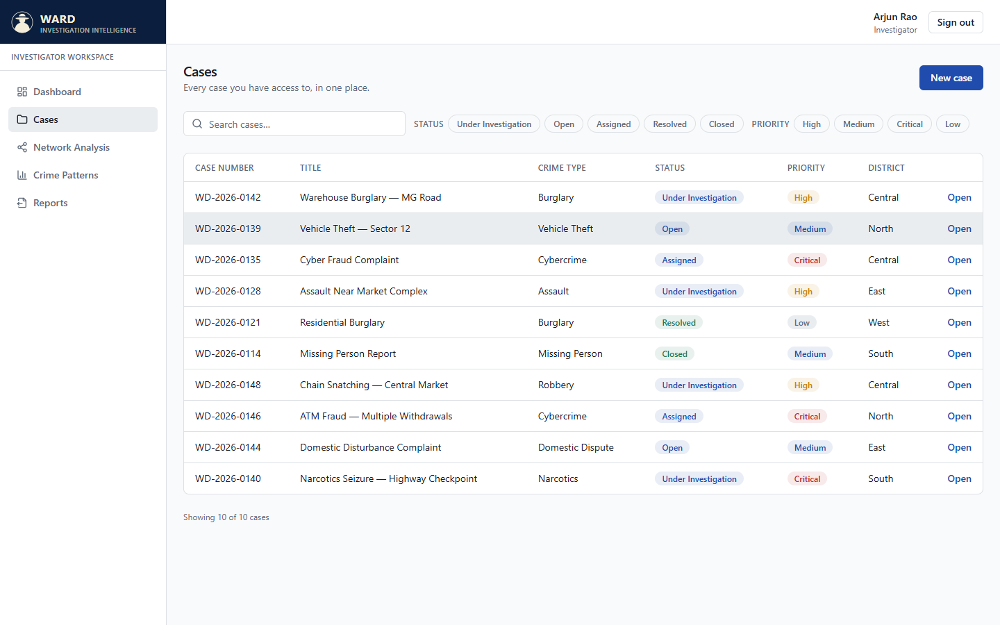
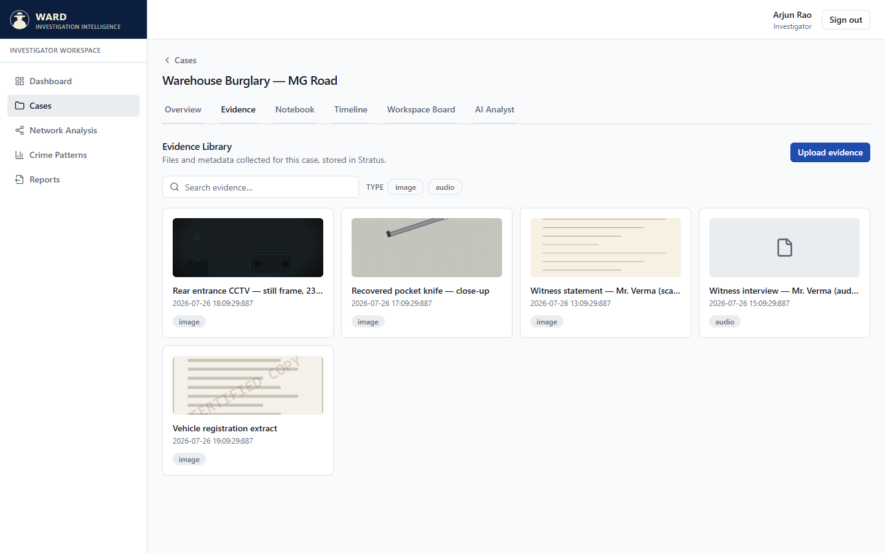
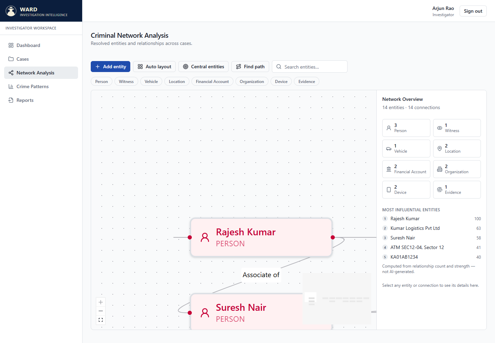
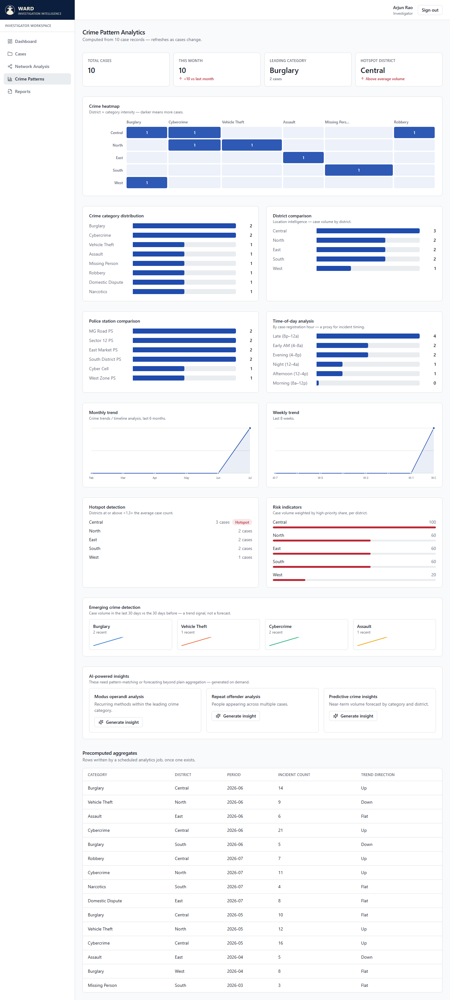
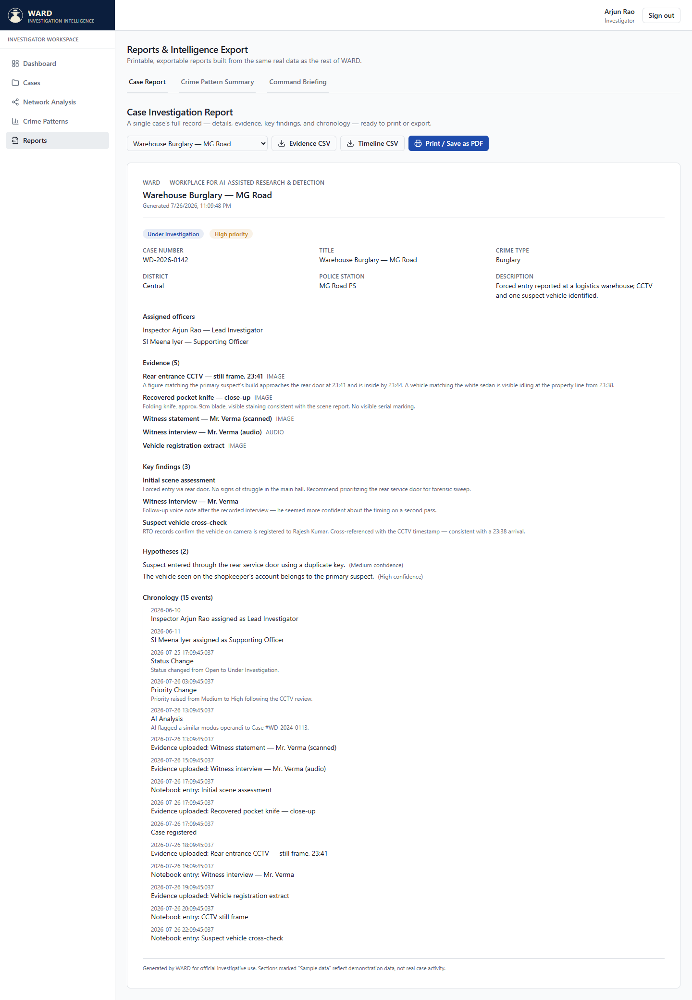

# WARD — Workplace for AI-assisted Research & Detection

**A complete investigation intelligence platform for modern police work — case management, evidence intelligence, criminal network analysis, crime pattern analytics, and AI-assisted investigation, unified in one workspace.**

<p align="center">
  
</p>

<p align="center">
  <a href="https://ward-60078547455.development.catalystserverless.in/app/index.html"><b>Live demo</b></a>
</p>

---

## The problem

Police departments run investigations across a patchwork of tools — paper case files, WhatsApp groups for evidence sharing, spreadsheets for crime statistics, and institutional memory for criminal network connections. Nothing talks to anything else. A supervisor can't see caseload across the department at a glance. An investigator can't tell if a suspect's vehicle already appears in another case. An analyst has no way to spot an emerging crime pattern before it becomes a trend line in next quarter's report.

**WARD is a single, unified workspace that replaces all of it** — built around one investigation at a time, but connected across every case in the department.

## What WARD does

WARD is organized around **12 complete modules**, each built to the same bar: real functionality, honest about what's genuinely computed versus what needs an AI backend that isn't wired up yet, and never a placeholder screen.

| # | Module | What it does |
|---|--------|--------------|
| 1 | **Case Management** | Full case lifecycle — register, assign, track status/priority, search and filter across the department's entire caseload. |
| 2 | **Case Workspace** | One investigation, one screen — every module for a case (evidence, notebook, timeline, board, AI analyst) lives as a tab, not a separate page. |
| 3 | **Investigation Workspace Board** | A drag-and-drop canvas (built on React Flow) linking suspects, victims, witnesses, vehicles, locations, and evidence into a visual case map, with undo/redo and auto-layout. |
| 4 | **Evidence Intelligence** | Upload and view photos, documents, audio, and video per case, with OCR text, transcripts, and AI-summary fields, chain-of-custody metadata, and full-text search. |
| 5 | **Investigation Notebook** | A running investigator's log — text, voice, image, and document entries, bookmarking, key-finding flags, and linking notes directly to evidence or people on the board. |
| 6 | **Smart Investigation Timeline** | An automatically assembled chronology of a case — registration, evidence uploads, notebook entries, and status/priority changes, merged into one real, filterable timeline (not a flat table). |
| 7 | **AI Investigation Assistant** | Case-context-aware Q&A per case. Similar Cases, Missing Evidence, and Next Best Action are **genuinely computed** from real case data today — no AI backend needed. Case Summary, Evidence Summary, and free-form questions are designed to call a real AI Function, and clearly label a sample response as a sample whenever that function isn't available. |
| 8 | **Criminal Network Intelligence** | A force-directed graph of entities and relationships across every case — centrality scoring, shortest-path discovery between any two entities, and focus/expand exploration, all computed client-side from real relationship data. |
| 9 | **Crime Pattern Analytics** | District × category heatmaps, monthly/weekly trend lines, statistical hotspot detection, composite risk scoring per district, and emerging-crime signal detection — all real aggregation, not mocked charts. |
| 10 | **Command Intelligence Dashboard** | The organization-wide view: caseload KPIs, status/priority breakdowns, district hotspots, officer workload, oldest-open-tasks, and a live cross-case activity feed. |
| 11 | **Role-Based Workspaces** | Four real roles (Investigator, Supervisor, Analyst, Administrator) each land on a different default page and see a role-appropriate nav — genuinely enforced by who's signed in, not a cosmetic toggle. |
| 12 | **Reports & Intelligence Export** | Print-ready / PDF-exportable case reports, crime pattern summaries, and command briefings, plus CSV export for underlying data — built for a real records-room workflow. |

## Why it's honest, not just a demo

Every "AI-powered" surface in WARD makes a clear distinction most hackathon projects blur:

- **Genuinely computed today** (similar-case matching, centrality scoring, shortest-path, hotspot detection, risk scoring) is labeled *Computed*, works with zero external dependency, and is real client-side logic, not a fake number.
- **Needs a real language model** (case summarization, free-form Q&A, predictive forecasting) always attempts a real call first, and — because no AI backend is wired into this build — falls back to a clearly **"Sample"**-badged response that's still grounded in the case's actual data, never a generic placeholder.

Nothing in this product pretends to be smarter than it is.

## Screenshots

<table>
<tr>
<td width="50%"></td>
<td width="50%"></td>
</tr>
<tr>
<td width="50%"></td>
<td width="50%"></td>
</tr>
<tr>
<td width="50%"></td>
<td width="50%"></td>
</tr>
</table>

## Tech stack

| Layer | Choice | Why |
|---|---|---|
| UI | React 19 + TypeScript, Vite 6 | Fast dev loop, strict typing across every data boundary |
| Styling | Tailwind CSS v4 (CSS-first `@theme`) | One design-token source of truth, dark mode included |
| Server state | TanStack Query v5 | Cache, retry, and invalidation for every read/write |
| Client state | Zustand | Session only — everything else is server state |
| Graphs | @xyflow/react (React Flow) | Powers both the Investigation Workspace board and the Criminal Network graph |
| Data | Zoho Catalyst Data Store *(local-storage/IndexedDB engine for this build — see below)* | Schema-driven throughout: the app detects real column names by pattern instead of hardcoding them |
| Hosting | Zoho Catalyst Client Hosting | Static build, deployed straight from `dist/` |

### A note on the data layer

WARD's service layer is built against a clean `ResourceService<T>` interface — list/get/create/update/remove/schema — so the actual backend is a swappable implementation detail. **This build runs on a local storage engine** (`src/services/localDb.ts` + IndexedDB for files) instead of a live Zoho Catalyst Data Store connection, so the whole product is fully demonstrable offline, with zero setup, and with real create/edit/delete that persists across reloads in your browser. Every table is schema-driven and column-pattern-matched exactly the way it would be against the real Data Store, so reconnecting a live Catalyst backend later is a matter of swapping the service implementation, not rebuilding the app.

## Getting started

```bash
npm install
npm run dev
```

Open **http://localhost:5173** — no environment variables, no backend setup, no API keys required.

### Sign in

Use any of the four quick-select accounts on the login screen, or sign in manually:

| Role | Email | Password |
|---|---|---|
| Investigator | `arjun.rao@cmpd.gov.in` | `demo123` |
| Supervisor | `meera.sharma@cmpd.gov.in` | `demo123` |
| Analyst | `priya.menon@cmpd.gov.in` | `demo123` |
| Administrator | `admin@cmpd.gov.in` | `demo123` |

Each role lands on a different default workspace (Cases / Dashboard / Crime Patterns / Dashboard respectively) and sees role-appropriate navigation.

## Building & deploying

```bash
npm run build      # produces dist/
npm run typecheck  # tsc -b --noEmit, zero errors
```

This project is configured as a Zoho Catalyst project (`catalyst.json`) with the client source pointed at `dist/`, ready for `catalyst deploy --only client` straight from the Catalyst Client Hosting service.

**Deployed instance:** https://ward-60078547455.development.catalystserverless.in/app/index.html

## Project structure

```
src/
  app/           App shell, routing, auth gate
  features/      One folder per module (cases, network, analytics, dashboard, reports, admin, auth)
  hooks/         TanStack Query hooks — one per resource, generated by a shared factory
  services/      The ResourceService implementations (currently local-storage backed)
  shared/        Design-system components, chart primitives, schema-driven form/table components
  types/         Shared TypeScript types (Catalyst row/schema shapes, per-domain records)
public/
  demo-assets/   Generated evidence photo/document placeholders used by the seed data
docs/
  screenshots/   Images used in this README
```

## What's next

- Reconnect the real Zoho Catalyst Data Store + Stratus for production data (the service interface is already built for this swap).
- Deploy the AI Function backing Case Summary / free-form Q&A / predictive insights.
- Expand Role-Based Workspaces with server-side authorization (today it's an honest client-side UX layer, not a security boundary).
